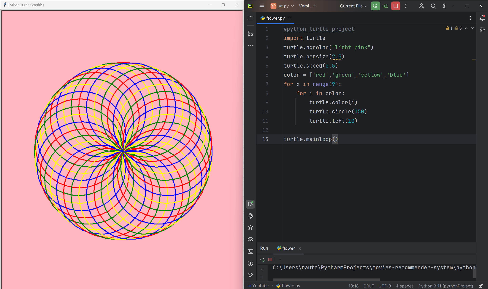

# Multi-Colored Circles

This code uses the Python Turtle library to create a beautiful, mesmerizing pattern of overlapping circles in four different colors. The circles are drawn in a loop, with each iteration changing the color of the circles. The speed function is set to 0.5, which means the turtle will draw the circles at a moderate speed.

# Tutorial is available on youtube channel 
click on the link to see :- ([Open in Youtube]())

# Screenshot

Rainbow-Spiral

# Features
Four colors: The pattern features four different colors (red, green, yellow, and blue) for the circles.
Overlapping circles: The circles are drawn in a way that they overlap each other, creating a complex and intricate pattern.
Moderate speed: The speed function is set to 0.5, which means the turtle will draw the circles at a moderate speed, allowing you to see the pattern being created.

Run
To run this code, save it to a file with a .py extension (e.g., multi_colored_circles.py) and execute it using Python (e.g., python multi_colored_circles.py). This will launch a window displaying the Multi-Colored Circles pattern.

License
This code is licensed under the MIT License. Feel free to modify, distribute, and use it for any purpose.

# snake.coding
We create a project each 4 days with voting on our <a href="https://youtube.com/@snakecoding_12" target="_blank">Youtube</a> channel.
You can vote for upcoming projects on our channel **community** page :wink:

